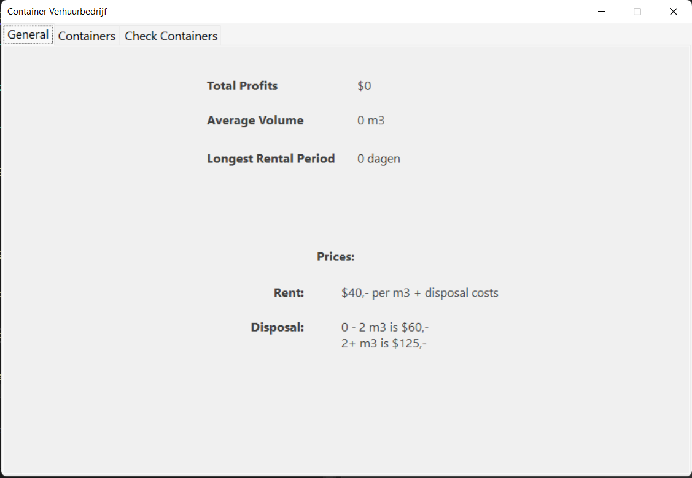

# Eindopdracht C#
**Eindopdracht C# - Opdracht 6: Containerverhuur** 
**Door:** *Joris Hummel*
**Datum:** *23-06-2022*

## Probleemdefinitie

De containerverhuurbedrijf wil een programma waarmee voor iedere container het volume van de bak, evenals de begin- en einddatum van de huurperiode kunnen worden ingevoerd. Voor iedere verhuurde container moeten de verschuldigde kosten worden berekend en getoond. Daarnaast moeten cumulatief de totale inkomsten, het gemiddelde volume en de langste huurperiode worden getoond.

### Invoer
|Case|Type|Voorwaarde|
|--|--|--|
|Container Nummer|`int`|`getal` > 0|
|Container Volume|`float`| `getal` > 0|
|Rent Start Date|`string`|formaat *"ddmmjjjj"*|
|Rent End Date|`string`|formaat *"ddmmjjjj"*|

### Uitvoer
|Case|Type|
|--|--|
|Huurkosten|`float`|
|Totale inkomsten|`float`|
|Gemiddelde Volume|`float`|
|Langste huurperiode|`string`|

### Berekeningen
|Case|Berekeningen|
|--|--|
|Huurkosten|aantal dagen * 40 * m3 + afvoerkosten|
|Totale inkomsten|Som van de totale rekeningen|
|Gemiddelde Volume|Som van alle volumes van ieder container / aantal containers|

### Constanten
de huur bedraagt € 40,- per m3 per dag.

### Bepalingen
Het afvoeren van een bak kost € 60,- als het volume van de bak 2 m3 of minder  
bedraagt, anders € 125,-.  

## GUI

## UML-Diagram

**RentalPeriod** is een abstracte klasse. De methodes in deze klasse zijn standaard methodes die de container klasse moet hebben, maar niet tot de klasse zelf behoort. Er kan met een abstracte klasse geen object gemaakt worden en biedt een stukje veiligheid in de code.

**Container** bevat een id, volume en een isAvailable velden. Deze velden komen rechtstreeks vanuit de database, zodat ze ergens opgeslagen kunnen worden in objecten zonder ze rechtstreeks vanuit de database op het scherm te plakken. Het is ook mogelijk om de totale winsten per container uit te kunnen rekenen aan de hand van de facturen uit de database.

**Invoice** bevat een id, start- en einddatum en erft de abstracte klasse **RentalPeriod** over en maakt deze gebruik van de methodes in de abstracte klasse.
Dit biedt de mogelijkheid om data te valideren en te bewerken naar gewenste formaat.

**ContainerRental** is in feite het bedrijf zelf. Deze slaat alle containers op in een lijst, om ze te kunnen valideren, uitprinten, bewerken, etc. Met deze klasse kan ook een container worden verhuurd, totale winsten uitberekend worden van alle containers bij elkaar, evenals de langste huur periode, gemiddelde container volume etc.

**ContainerRDBMS** is een klasse die alle database queries afhandelt. Dit om overzicht in de code te bewaren. Het is een volledig statische klasse.

De klasse **ContainerRental** is niet statisch, omdat er meerdere containerverhuurbedrijven kunnen zijn, daarom worden er hier wel objecten van gemaakt.

## ERD

# Testgegevens

## GUI
De tabbladen werken zoals behoren:
- **General:** *gaat naar de hoofdpagina.*
- **Containers:** *gaat naar de container overzichtspagina, waar alle containers zichtbaar op een rij staan.*
- **Zoekbalk:** *als daar een containernaam ingevuld wordt, gaat deze naar de desbetreffende overzichtspagina van de container.*

De goud-gele knop moet volgens verwachtingen werken:
- De okay knop in de **'about-box'** wijst naar de **'General'** tabblad.
- De okay knop in de individuele container tabblad wijst naar de container overzichtspagina.

Als er bij de container overzichtspagina op het labeltje **'Container Id'**, **'Total Volume'** of **'Available'** wordt gedrukt, filtert de lijst op containers op volgorde van de label:
- **'Container Id':** *zorgt voor volgorde van de container Id benaming.*
- **'Total Volume':** *zorgt voor de volgorde van de totale volume.*
- **'Available':** *zorgt voor de volgorde van beschikbare containers*

## Test Cases
**Ophalen van containers**

Als er op het tabblad *Containers* gedrukt wordt, worden alle containers opgehaald uit de database in de `containers: List<Container>` uit de `ContainerRental` klasse. 

**Verwijderen van containers**
Als er op het tabblad *Containers* gedrukt wordt, zie je een verwijder knop naast een container. Als hierop gedrukt wordt, zal de container worden verwijderd uit het tabbel en uit de database en worden alle gegevens aangepast.

|Invoer|||Uitvoer|||
|--|--|--|--|--|--|
|Container| Begindag|Einddag|Kosten|Totale inkomsten|Langste period|
|`2m3`|`01-01-2022`|`05-01-2022`|`380`|`380`|`4 dagen`|
|`18m3`|`02-01-2022`|`06-01-2022`|`3005`|`3385`|`4 dagen`|
|`37m3`|`01-01-2022`|`10-01-2022`|`13445`|`16830`|`9 dagen`|
|``|``|``|``|``|``|

